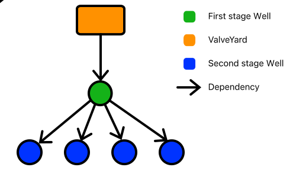

=============
The Well Task
=============
The Well task has the responsibility of performing the work of a daq procedure. The Well task is split into two stages. The first (or upper) stage
is performed by the taks that is the direct child of a ValveYard task. The second (or lower) stage is a second layer of Well tasks that are children
of the first stage Well task.

The well task splits the daq procedure into as many parts as there are workers to achieve maximum parallelism during daq and postprocessing of the measurements.

First stage
-----------
The first stage is responsible for distributing tasks to the second stage wells. It does this by modifying the ``parameters`` section of the ``procedure``
field in the :doc:`system state </architecture/system_state>` to contain a subset of all the runs. It does this by splitting the patch tree into subtrees
and passing the different subtrees to the different second stage well tasks See :doc:`configuration generation </architecture/configuration` for more details.
 
.. figure:: ../images/Config\ split.svg
  
  The nodes of the same color denote the parameters that are passed to a second stage Well task. The mixed color node is passed to all second stage tasks.

The second stage tasks generate the patch sets from their respective subtrees.

Second stage
------------
The second stage is responsible for performing the daq and mesurement postprocessing. The full configuration is also built at this stage from the ``default`` and
``init`` files which are patched with the configuration generated by the ``parameters`` section of the proceure configuration.

The DataField task is at the core of the DAQ Procedure. It is responsible for generating the configuration for each run. It does this by applying
modifications to the configuration and then passing on that configuration to the child tasks. In particular it modifies the 
``procedure/target_settings/initial_config`` field by adding or overwriting values provided by the user. It also merges the calibration
provided by the ``Calibration`` task.

The DataField can operate in two modes, loop mode and normal mode.

* In normal mode the DataField will look at the ``produces/parameters`` field.
  The ``procedures/parameters`` field is either a list of lists dicts with length 1 (case A) or a list of lists of dicts with length > 1 (case B).
  
  * In case A the DataField spawns a ``DrillingRig`` for every entry in the ``A[0]`` and passes it a ``system_state`` where the ``produces/target_settings/initial_config`` has been patched
    with the dict that is the entry in the list.

  * In case B the DataField examines the first element of the list of lists, which needs to be a list of dicts and spawns a DataField for every dict
    in ``B[0]`` modifying the ``produces/parameters`` field to only contain ``B[1:]``. The child DataFields will be passed a 
    ``system_state`` where the ``produces/target_settings/initial_config`` has been patched with the dict from the entry in ``B[0]``.
    This is done until the list of lists is of length 1, which is case A.
* In loop mode the behaviour of the DataField as well as of the ValveYard changes. When the ``procedures/parameters`` field is of length 2
  the DataField instantiates a Fracker task per entry in ``B[0]`` instead of a DataField task. Passing the Fracker task ``[B[1]]`` as 
  ``procedures/parameters`` field.

Output
------
The 
