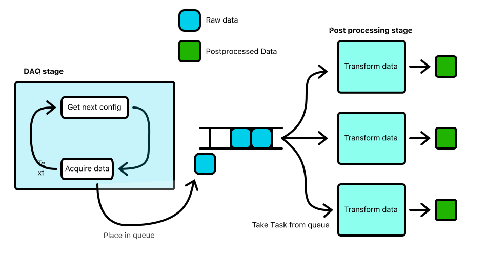

=============
The Well Task
=============
The Well task has the responsibility of performing the work of a daq procedure. The Well task generates the run configurations and sends them to the
daq coordinator. The resulting data is then passed to subprocesses in the same task for parallel fracking. Then the postprocessed data is either merged
into a single output file which is passed to the parent task or, depending on the ``merge`` configuration option of the procedure, the run outputs are
passed to the parent task without being concatenated.

The well task splits the daq procedure into as many parts as there are workers to achieve maximum parallelism during daq and postprocessing of the measurements.
The amount of workers is configurable by the user via the command line option ``-w``

The well task splits into two stages, the daq stage and the postprocessing stage, these stages run in different processes to allow for the postprocessing to execute
in parallel to the daq tasks.

DAQ Stage
---------
The DAQ stage is responsible for generating the fully qualified configurations for each run. It then aquires the data from the DAQ system in a serial manner.
It then places the DAQ and the configurtation file into a queue for the Postprocessing stage to pick up and format into the output file. There are multiple
instances of the postprocessing stage running in different processes that all are take fracking tasks from the queue that is attached to the DAQ stage.

The DAQ stage also saves the raw information and the configuration for the corresponding run in the working directory of the procedure. To acquire the data the DAQ 
stage communicates to the DAQ coordinator via a ZMQ push-pull socket. The format of the message is documented on the :doc:`daq coordinator <\architecture\daq-coordinator>` Page.

The DAQ stage invoces the processes running the postprocessing stage with the following arguments:

**task_queue**
  the queue to fetch work from  

**fully_qualified_initial_config**
  the default config of the system

**data_columns**
  the data columns that are to be placed into the fracked DataFrames the data columns have to match names of the columns of the measured data or the Configuration

**mode**
  the mode in which the data was aquired, so either ``summary`` or ``full``
 
After all the postprocessing tasks have been completed, the DAQ stage merges the outputs into a single file, if the ``merge`` field of the procedure configuration is set 
to ``true``.

Postprocessing stage
--------------------
The postprocessing stage of the Well task runs in multiple instances. It converts the raw data from the measurement into a structure on disk that can be loaded
into a pandas DataFrame and includes all relevalt columns from the measured data and the chip configuration. It uses C++ utilities to convert the  data first into
a root file and then into a HDF5 file that also includes the calibration columns.

If one of the tools fail, it deletes all the outputs for that particular run and also removes the raw file and configuration for the failed run allowing the DAQ stage 
to reacquire only what is needed when invoced more than once.

